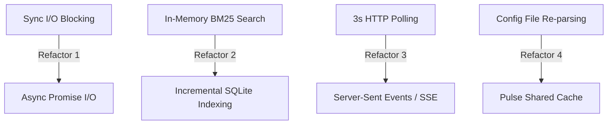

# Architectural Review: Inefficiencies Analysis (Release v5.0.0)

- **Status**: Complete
- **Date**: 2026-06-21
- **Architect**: Antigravity
- **Type**: Performance & Scalability Audit

---

## 1. Context & Scope

This review audits the core runtime subsystems of PAI (Unified Pulse Daemon, Hooks, Memory Harvester, and Observability Dashboard) to identify performance bottlenecks, CPU/memory bloat, I/O blocking, and network overhead.

---

## 2. Identified Inefficiencies & Bottlenecks

### A. Thread-Blocking Sync I/O in Hooks and Daemons
- **Symptoms**: Frequent use of `readFileSync`, `writeFileSync`, `existsSync`, and synchronous JSON parsing throughout the hooks pipeline (`hooks/*.hook.ts`, `hooks/handlers/*.ts`) and Pulse daemon modules (`user-index.ts`, `observability.ts`).
- **Root Cause**: UNIX-centric CLI scripts were written as simple scripts where synchronous blocking was acceptable. However, in a daemon-based multitasking system, these sync calls block the single-threaded event loop.
- **Impact**: Concurrently triggered hooks or simultaneous HTTP dashboard queries will stall, generating measurable latency (up to 150-300ms per blocking operation under load).

### B. O(N) In-Memory Text Retrieval (BM25 Scaling)
- **Symptoms**: `MemoryRetriever.ts` reads, tokenizes, and calculates BM25 scores in-memory across the entire Markdown knowledge archive (`PAI/MEMORY/KNOWLEDGE/`) on every semantic query.
- **Root Cause**: Rejection of database dependencies in favor of raw Markdown files.
- **Impact**: Fine for small archives (<100 files). However, as a user compiles journals, reading and parsing thousands of Markdown files on the fly scales poorly, leading to CPU spikes and memory consumption during tool execution.

### C. Dashboard HTTP Polling Overhead
- **Symptoms**: The Next.js Observability dashboard polls the Pulse `/api/events/recent` endpoint every 3 seconds.
- **Root Cause**: Implementation of simple client-side polling rather than a persistent push interface.
- **Impact**: High network polling traffic. Each poll triggers disk reads of `tool-failures.jsonl`, `tool-activity.jsonl`, and `subagent-events.jsonl` to generate the recent events array, causing constant minor disk I/O thrashing.

### D. Redundant Configuration Parsing
- **Symptoms**: `identity.ts` re-reads and re-parses `settings.json` and `DA_IDENTITY.md`/`DA_IDENTITY.yaml` on every single hook lifecycle phase (SessionStart, PreToolUse, PostToolUse, Stop).
- **Root Cause**: Lack of an in-memory configuration cache across execution runs.
- **Impact**: Redundant CPU cycles spent parsing identical YAML/JSON files.

---

## 3. Recommended Refactoring Plan

### Refactoring 1: Transition to Asynchronous I/O (`fs.promises`)
- **Action**: Replace synchronous filesystem methods with async methods in hook handlers.
- **Tradeoff**: Increases async callback/Promise wrapping, but opens up the event loop to run concurrently.

### Refactoring 2: Implement SQLite-backed FTS5 or Vector Cache
- **Action**: Introduce a lightweight local SQLite database (via Bun's native `bun:sqlite` which is extremely fast) to store pre-tokenized documents and indexes. Implement a file-watcher to incrementally update the index only when files change.
- **Tradeoff**: Adds a single database file, but keeps documents in human-readable Markdown while reducing search time to $O(1)$.

### Refactoring 3: Establish Server-Sent Events (SSE) or WebSockets
- **Action**: Change the Next.js frontend to establish a long-lived SSE stream from the Pulse Observability API. The server only pushes events when `events.jsonl` files receive appends.
- **Tradeoff**: Marginally increases server connection state memory, but entirely eliminates client polling and redundant disk reads.

### Refactoring 4: Shared Memory Caching in Pulse
- **Action**: Cache the parsed configuration inside the daemon process. When hooks execute, they query the hot cache via local HTTP or domain sockets instead of parsing local disks.
- **Tradeoff**: Requires invalidating the cache when the user edits `settings.json`, which can be handled by a filesystem watch hook.
